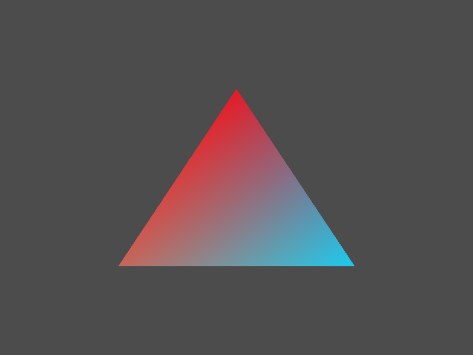
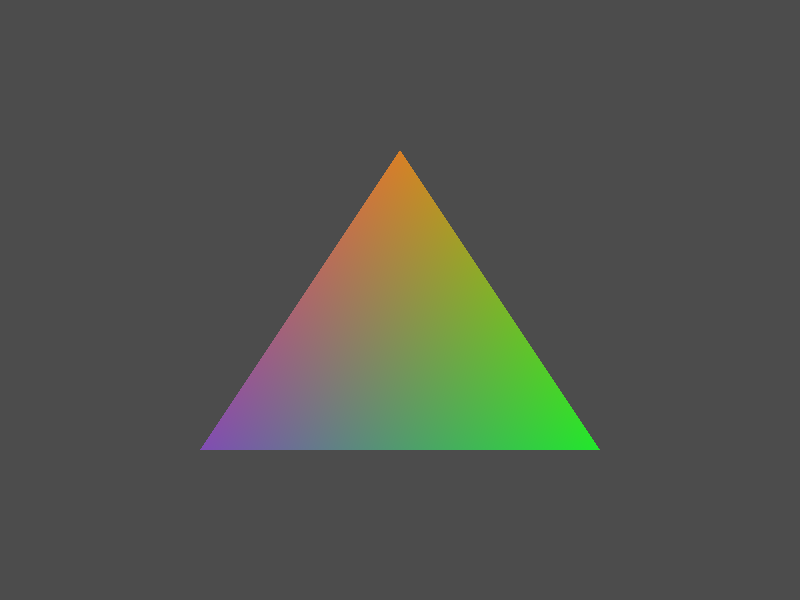
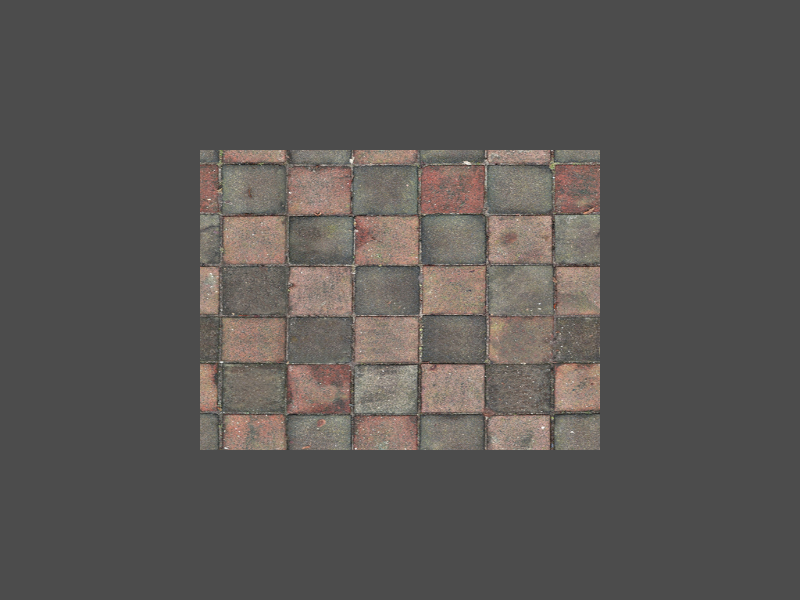

# Learn OpenGL

This project is a keeper of LearnOpenGL course.

See here: https://learnopengl.com/Introduction

# Dependencies

- GLFW
- GLAD
- OpenGL

# Building

For building this project you will need Cmake.

This project uses separated build files for each Chapter.

- Create a directory called `build`
- Inside it, run: `cmake ../` and `make`

Each executable will be build inside its folder.

So `HelloTriangle` Chapter executable will be inside `Chapter-HelloTriangle`, you only need to run: `./Chapter-HelloTriangle/HelloTriangle`. You can also navigate to `Chapter-HelloTriangle` and run: `./HelloTriangle`

**This project was tested only on Ubuntu.**

# Path

- [x] Creating Window
- [x] Hello Window
- [x] Hello Triangle

<table style="width: 40%;margin:auto;">
    <tr>
        <td>
            
            

                Hello Triangle
            

        </td>
    </tr>
</table>

- [x] Shaders

<table style="width: 40%;margin: auto;">
    <tr>
        <td>
            
            

                Shader
            

        </td>
    </tr>
</table>

- [x] Textures

<table style="width: 40%;margin: auto;">
    <tr>
        <td>
            
            

                Texture
            

        </td>
    </tr>
</table>

- [x] Transformations
- [x] Coordinate Systems
- [x] Camera

<table style="width: 40%;margin: auto;">
    <tr>
        <td>
            
            

                Camera Flying around
            

        </td>
    </tr>
</table>

- [x] Colors
- [x] Lightning
- [x] Materials
- [x] Lighting maps

<table>
    <tr>
        <td style="width: 40%">
            
            

                Specular map
            

        </td>
        <td style="width: 40%">
            
            

                Matrix emission map
            

        </td>
    </tr>
</table>

- [ ] Light casters
- [ ] Multiple lights
- [ ] Assimp
- [ ] Mesh
- [ ] Model
- [ ] Depth
- [ ] Stencil
- [ ] Blending
- [ ] Face culling
- [ ] Framebuffers
- [ ] Cubemaps
- [ ] Advanced Data
- [ ] Advanced GLSL
- [ ] Geometry Shaders
- [ ] Anti aliasing
- [ ] Advanced Lightning
- [ ] Gamma Correction
- [ ] Shadows
- [ ] Point Shadows
- [ ] Normal Mapping
- [ ] Parallax Mapping
- [ ] HDR
- [ ] Bloom
- [ ] Deferred Shading
- [ ] SSAO
- [ ] PBR
- [ ] Text rendering

---

# Exercises

Every LearnOpenGL's sections come with some exercises. Each exercise will be done within a new branch prefixed with `exercise/`.