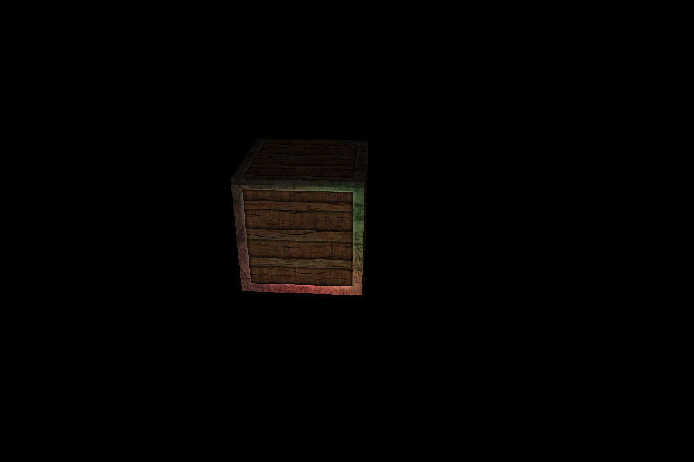

# Exercise

- Name: Colored specular mapping

- Description: Try creating a specular map from the diffuse texture that uses actual colors instead of black and white and see that the result doesn't look too realistic

